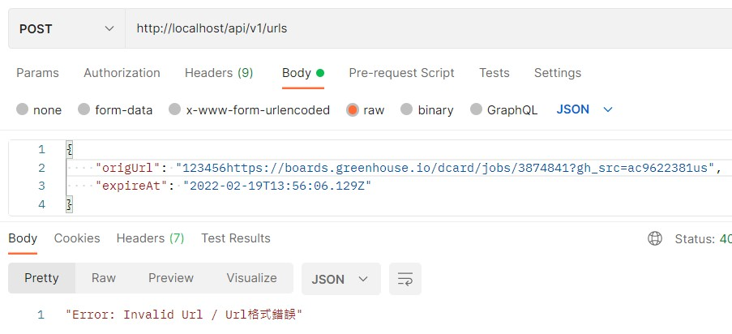
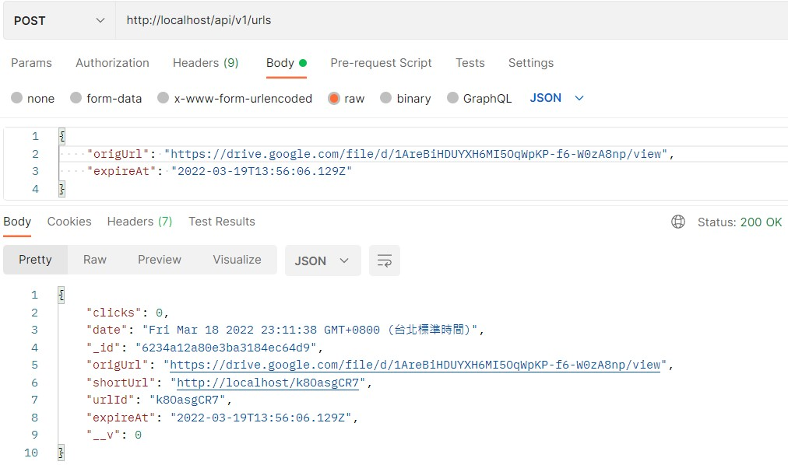
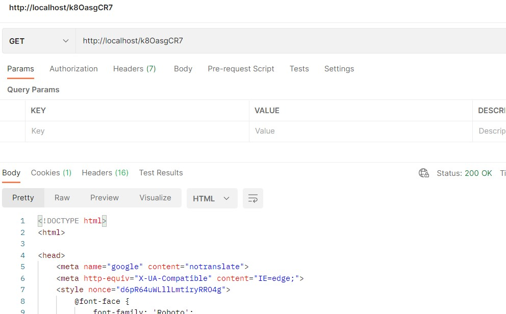
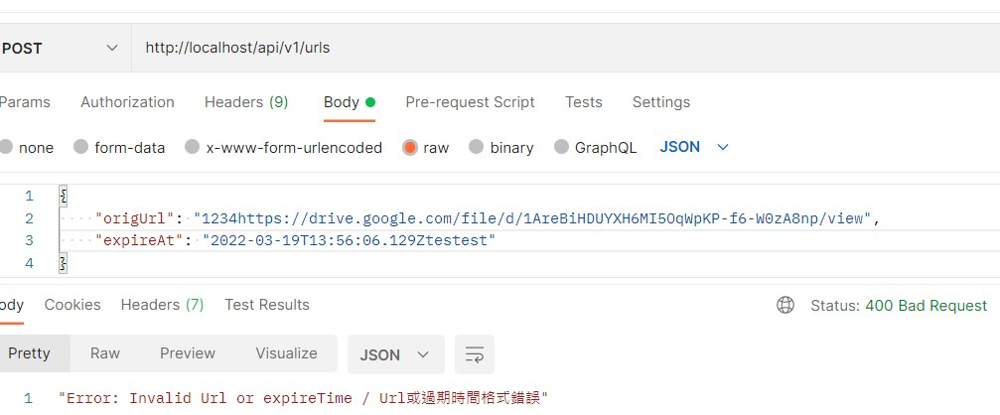

# This repo is for Dcard - URL Shortener API

## Criteria
1. **URL shortener has 2 APIs**
   - A RESTful API to upload a URL with its expired date and response with a shorten URL.   
   - An API to serve shorten URLs responded by upload API, and redirect to original URL. If URL is expired, please response with status 404.   

2. **Please feel free to use any external libs if needed.**
3. **External storage** 
   - **MongoDB**
   - 是一種文件導向的資料庫管理系統   
   - Schema-less : MongoDB 具較有彈性的 Schema，因此沒有使用類似於MySQL來實作這個專案。   
   - 容易擴展 : MongoDB 採水平擴展，很容易在多台伺服器之間進行數據分割。   
   - 有[SaaS](https://cloud.mongodb.com/v2/62346f8992925b716e04619f#metrics/replicaSet/62347113da869e5f2c83013f/explorer/myFirstDatabase/urls/find)可遠端存取，不須在本地端。   
4. **Constrains and error handling of these 2 APIs.**
5. **Don't need to consider auth**
6. **Many clients might access shorten URL simultaneously or try to access with non-existent shorten URL, please take performance into account.**
    - Url檢查
    
    - 程式碼
        ```javascript
        function validateUrlFormat(url) {
            return /^(?:(?:(?:https?|ftp):)?\/\/)(?:\S+(?::\S*)?@)?(?:(?!(?:10|127)(?:\.\d{1,3}){3})(?!(?:169\.254|192\.168)(?:\.\d{1,3}){2})(?!172\.(?:1[6-9]|2\d|3[0-1])(?:\.\d{1,3}){2})(?:[1-9]\d?|1\d\d|2[01]\d|22[0-3])(?:\.(?:1?\d{1,2}|2[0-4]\d|25[0-5])){2}(?:\.(?:[1-9]\d?|1\d\d|2[0-4]\d|25[0-4]))|(?:(?:[a-z\u00a1-\uffff0-9]-*)*[a-z\u00a1-\uffff0-9]+)(?:\.(?:[a-z\u00a1-\uffff0-9]-*)*[a-z\u00a1-\uffff0-9]+)*(?:\.(?:[a-z\u00a1-\uffff]{2,})))(?::\d{2,5})?(?:[/?#]\S*)?$/i.test(
            url);
        }
        ```
## Steps
本API使用 MongoDB and Node.js 實作
> 較擅長使用、快速易上手。
> Node.js 有數百個 libs，並且有很多教學和第三方平台。Javascript 社群也相當多與貢獻，足以在各種現實場景中完成任務。

### 1. initialization

`npm install`

**安裝需要的 dependencies**
  - Express.js: 一個用在 Node.js 最小且靈活的 Web 應用程式框架   
  - Mongoose: 用在 Node.js 的 MongoDB 工具   
  - dotenv: 可將環境參數從 .env 加到 process.env   
  - ShortId: 能夠為 URL 生成縮短的 ID   
  - nodemon: 用於開發。可以在文件更改時自動重啟 Node.js 伺服器

`npm i express mongoose dotenv shortid`
`npm i -D nodemon`

### 2. 創建 `app.js`
使用 Express 在 app.js 檔案中設置伺服器。首先，將 Express 套件導入 `app.js` 。並對其進行初始化後將其存到參數 app 中。

```js
const express = require('express');
const app = express();
// 利用listen function 監聽並設置 server
const PORT = 80;
app.listen(PORT, () => {
  console.log(`Server is running at PORT ${PORT}`);
});
```

### 3. 連接 MongoDB 到 app 中
在根目錄下建立 config 資料夾，並新增一 `.env` 檔案。
```
MONGO_URI=mongodb+srv://<userName>:<password>@<ip>/myFirstDatabase?retryWrites=true&w=majority
```

接著建立一 `db.js` 檔案。
```js
// 載入 Mongoose 和 dotenv dependencies
const mongoose = require('mongoose');
// 利用 dotenv 讓路徑在配置中傳送，因 .env 不在根目錄中。通過這個傳送 .env 的位置
require('dotenv').config({ path: './config/.env' });

// 利用非同步function connectDB，連接資料庫到 app
const connectDB = async () => {
  try {
    await mongoose.connect(process.env.MONGO_URI, {
      useNewUrlParser: true,
      useUnifiedTopology: true,
    });
    console.log('資料庫已連接');
  } catch (err) {
    console.error(err.message);
    process.exit(1);
  }
};

module.exports = connectDB;
```

### 4. 在 MongoDB 建立 Mongoose schema
```js
const mongoose = require('mongoose');

const UrlSchema = new mongoose.Schema({
  urlId: {
    type: String,
    required: true,
  },
  origUrl: {
    type: String,
    required: true,
  },
  shortUrl: {
    type: String,
    required: true,
  },
  clicks: {
    type: Number,
    required: true,
    default: 0,
  },
  date: {
    type: String,
    default: Date.now(),
  },
  expireAt:{
    type: String,
    required: true,
  },
});

module.exports = mongoose.model('Url', UrlSchema);
```

### 5. 建立一 `URL` 與 index routes
在根目錄下建立 routes 資料夾，並新增一 `urls.js` 檔案。 此路由將從原始 URL 創建一個縮短後的 URL 並存在資料庫中。首先，載入需要的套件。
```js
// 載入 packages
const express = require('express');
const router = express.Router();
const shortid = require('shortid');
const Url = require('../models/Url');
const utils = require('../utils/utils');
require('dotenv').config({ path: '../config/.env' });
```
使用 HTTP POST 請求來產生資料 (origUrl, expireAt) 並存到資料庫。
```js
// 將原始 URL 建立一個短 URL 並存儲在資料庫中
router.post('/v1/urls', async (req, res) => {
  const { origUrl, expireAt } = req.body;
  const base = process.env.BASE;
  
  const urlId = shortid.generate();
  if (utils.validateUrlFormat(origUrl)) {
    try {
      let url = await Url.findOne({ origUrl });
      if (url) {
        res.json(url);
      } else {
        const shortUrl = `${base}/${urlId}`;

        url = new Url({
          origUrl,
          shortUrl,
          urlId,
          expireAt,
          date: new Date()
        });

        await url.save();
        res.json(url);
      }
    } catch (err) {
      console.log(err);
      res.status(500).json('Server Error / 伺服器錯誤');
    }
  } else {
    res.status(400).json('Error: Invalid Url or expireTime / Url或過期時間格式錯誤');
  }
});

module.exports = router;
```

接著使用 HTTP GET 回應原始 URL 並測試是否超過過期時間。
```js
router.get('/:urlId', async (req, res) => {
  try {
    const url = await Url.findOne({ urlId: req.params.urlId });
    const expiredTime = url.expireAt;
    const now = Date.now();
    if (now < Date.parse(expiredTime)) {
      if (url) {
        url.clicks++;
        url.save();
        return res.redirect(url.origUrl);
      } else res.status(404).json('Not found / 該短連結不存在'); 
    } else{
      res.status(404).json('Not found / 該短連結已過期');
    }
  } catch (err) {
    console.log(err);
    res.status(500).json('Server Error / 伺服器錯誤');
  }
});
```


## API

### URL shortener
[Postman](https://www.postman.com/) 測試 API

```http
  POST /api/v1/urls
```
| Field | Type   | Description        |
| :-    | :-     | :-                 |
| Body  | `json` | Input original Url |
| Body  | `json` | Expired Time       |

**Example**


### Get
- GET http://localhost/<url_id> => REDIRECT to original URL   
- 判斷是否已經過期

```http
  GET /:id
```

| Parameter | Type     | Description |
| :-        | :-       | :-          |
| `id`      | `string` | url_id      |

**Example**



## 在本地端執行

Clone the project

```bash
  git clone https://github.com/kenchen879/urlShortener-Dcard
```

Go to the project directory

```bash
  cd urlShortener-Dcard
```

Install dependencies

```bash
  npm install
```

Start the server

```bash
  npm run start
```
